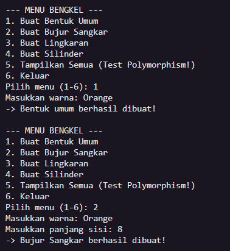
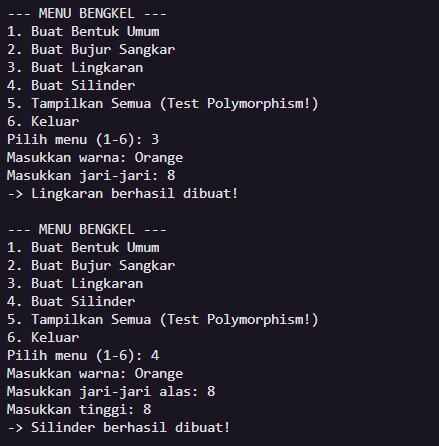
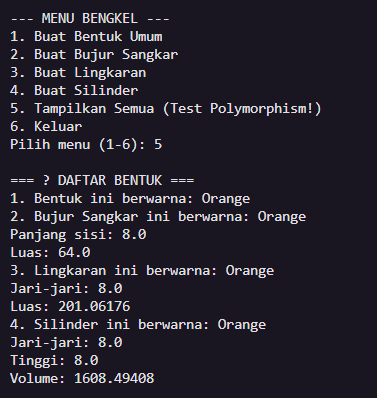

# 📐 Tugas Eksplorasi PBO - Hierarki Bentuk Geometri

Repository ini berisi implementasi Latihan/Eksplorasi materi **Inheritance** (Pewarisan) dan **Polymorphism** dalam bahasa Java.
Program ini membentuk hierarki bangun datar dan ruang, serta dilengkapi dengan menu CLI interaktif berbasis `java.util.Scanner`.

## 🧠 Penerapan Konsep Utama OOP dalam Kode

### 1. Encapsulation (Pengkapsulan)

Konsep ini diterapkan untuk menyembunyikan data dan melindunginya dari akses langsung, memaksa penggunaan _Getter_ dan _Setter_.

- Pada class `Bentuk`, variabel `warna` menggunakan _access modifier_ `protected` agar aman dari akses luar, namun tetap bisa dibaca langsung oleh _subclass_ turunannya.
- Pada class `BujurSangkar`, `Lingkaran`, dan `Silinder`, atribut spesifik seperti `sisi`, `radius` (protected), dan `tinggi` menggunakan _modifier_ `private` (murni tertutup), dan hanya bisa diakses via fungsi getter/setter.

### 2. Inheritance (Pewarisan)

Konsep di mana sebuah class (anak) mewarisi atribut dan metode dari class lain (induk), sehingga mencegah penulisan kode berulang (_Code Reuse_).

- **Single Inheritance:** Class `BujurSangkar` dan `Lingkaran` diturunkan secara langsung dari induknya dengan _keyword_ `extends Bentuk`. Mereka otomatis mendapatkan atribut `warna` dan fungsi `getWarna()`. Pemanggilan konstruktor induk dilakukan menggunakan `super(warna)`.
- **Multi-level Inheritance:** Class `Silinder` membuktikan pewarisan bertingkat karena ia di-_extends_ dari `Lingkaran`. Ia tidak hanya mewarisi `radius` dari ayahnya (`Lingkaran`), tapi juga mewarisi `warna` dari kakeknya (`Bentuk`). Pada fungsi `hitungVolume()`, `Silinder` bahkan menggunakan kembali fungsi `hitungLuas()` warisan ayah-nya.

### 3. Polymorphism (Banyak Bentuk)

Kemampuan sebuah objek atau metode untuk mengambil banyak bentuk.

- **Method Overriding:** Di class `BujurSangkar`, `Lingkaran`, dan `Silinder`, fungsi `printInfo()` dari class induk (`Bentuk`) ditimpa (_di-override_) agar mencetak spesifikasi tambahan seperti "Luas" dan "Volume" yang unik untuk setiap bangun.
- **Polymorphism in Array:** Pada class `Main.java`, dibuat sebuah _array_ dengan tipe induk yaitu `Bentuk[] daftarBentuk`. Ajaibnya, array ini bisa diisi dengan objek anak yang berbeda-beda (`new BujurSangkar()`, `new Lingkaran()`, `new Silinder()`). Saat dilakukan _looping_ pemanggilan `daftarBentuk[i].printInfo()`, Java secara dinamis (Dynamic Method Dispatch) mengeksekusi versi `printInfo()` yang berbeda-beda sesuai wujud objek aslinya.

---

## 📸 Screenshot Program (Output Menu Interaktif)

1. **Pembuatan Objek Geometri (Menu 1-4)**
   
   

   //bentuk, bujursangkar

   

   //lingkaran, silinder

3. **Pembuktian Polymorphism (Menu 5)**

   

   //pholymorphism check
